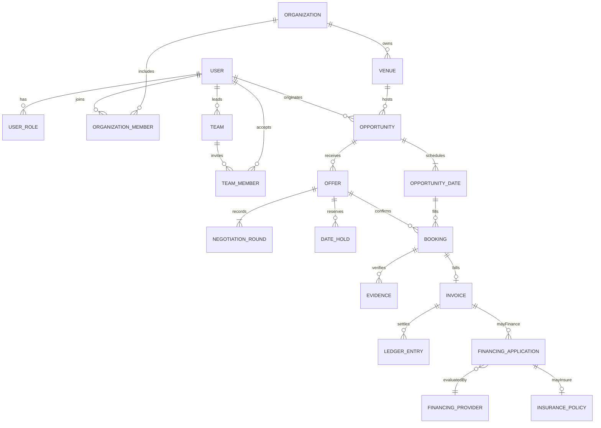

# ARTI — arquitectura de producto y desarrollo

Versión 1 · 8 de octubre de 2026. Fuente: [especificación de 120 apartados](../ARTI-SPECIFICATION.txt). Este documento se entrega antes de implementar los nuevos módulos. ARTI evoluciona el repositorio ARTIVO; conserva sus reservas, perfiles, feed y cartera. No activa productos financieros reales.

## A. Product Architecture

La unidad central es una oportunidad con fechas y plazas. Una propuesta identifica solicitante, proveedor, equipo, condiciones y origen. Al acordarla nacen reservas operativas y eventos. La evidencia permite verificar el servicio; la factura registra lo debido; el settlement distribuye lo cobrado. El feed descubre talento y demanda. Una organización puede contratar o proveer; ningún rol se deduce de una etiqueta visual.

Dominios: Identity, Social, Talent, Demand, Negotiation, Availability, Booking, Execution, Organization, Team, Billing, Settlement, Trust, Media, Notifications y Analytics. Las capas Credit, Financing e Insurance se conectan después de consolidar los dominios iniciales.

La demo Pages continúa siendo local a cada navegador. El backend Python conserva sesiones y autorización real. La persistencia inicial SQLite no se presenta como infraestructura para un millón de usuarios. El siguiente despliegue compartido exige PostgreSQL, trabajadores, almacenamiento externo y observabilidad.

## B. Business Model

Comisión por booking, suscripción empresarial, herramientas de líderes/agencias y perfiles premium son líneas independientes. La comisión es una regla versionada que se captura al acordar el contrato. No mezclar ingresos ARTI, importes del proveedor, impuestos, costes de cobro, financiación y seguros. El modelo inicial mantiene la comisión configurable existente. Una cotización siempre muestra moneda, precio por evento, número de fechas y neto; «desde» no compromete un precio final.

## C. User Roles / RBAC

Los cuatro roles de acceso históricos siguen funcionando. Los roles adicionales se asignan, no se autoconceden, y pueden coexistir. Membresías limitan permisos a su organización y los equipos a su líder.

| Familia | Roles | Alcance |
|---|---|---|
| Plataforma | SUPER_ADMIN, ARTI_ADMIN, ARTI_OPERATIONS, ARTI_FINANCE, ARTI_RISK, ARTI_SUPPORT | Permisos separados de configuración, operación, contabilidad, riesgo y soporte |
| Empresa | ENTERPRISE, ENTERPRISE_ADMIN, ENTERPRISE_MANAGER, ENTERPRISE_FINANCE | Organización y venues autorizados |
| Intermediación | AGENCY, PROMOTER, VENUE_MANAGER, EVENT_ORGANIZER, HOST, LEADER, BAND_LEADER, MANAGER, INTERMEDIARY | Publicar, proponer y coordinar según membresía |
| Talento | PROVIDER, ARTIST, MUSICIAN, DJ, SINGER, BAND, TECHNICIAN, PRODUCTION_PROVIDER | Perfil, propuestas y eventos propios |
| Partners | PARTNER_BANK, PARTNER_FACTOR, PARTNER_INSURER | Solo expedientes y operaciones autorizadas de su integración |

RBAC decide capacidad; controles de pertenencia y participación deciden acceso al registro. El administrador concede roles y deja audit trail. Ningún usuario puede obtener acceso financiero eligiendo un rol desde el navegador. La demo identifica explícitamente sus cuentas sintéticas.

## D. User Journeys

Artista: perfil → disponibilidad → descubrir demanda → propuesta → negociar → retención temporal → contrato → call time → llegada → evidencia → servicio → factura → settlement → reputación. Empresa: organización → venues → oportunidad → revisar propuestas → acordar → verificar ejecución → factura → pagar. Líder: equipo → miembros → propuesta de equipo → fechas → asignación consentida → seguimiento → sustitución → liquidación. Agencia: origen de oportunidad → representación autorizada → propuesta → coordinación → comisión pactada.

## E. Marketplace Flow

El tablero filtra categoría, ciudad, moneda, presupuesto y fechas. Las oportunidades muestran solicitante, condiciones, número de plazas y fecha límite. La información privada depende de la visibilidad. Aplicar no confirma un contrato. Cerrar plazas es una operación atómica. No fabricar reputación, verificación o porcentajes de matching.

## F. Social Flow

Feed profesional: actuaciones, portfolios, disponibilidad y oportunidades. El feed existente mantiene likes, comentarios, guardados, seguimiento y reportes. El tablero de oportunidades complementa el contenido social; una integración posterior permitirá convertir publicaciones y publicar como organización. La moderación registra quién reportó y quién decidió. La eliminación conserva referencias operativas cuando corresponde.

## G. Enterprise Flow

Organización → miembros y venues → plantilla de oportunidad → fechas explícitas o recurrencia semanal → recepción de propuestas parciales/totales → aceptación atómica → centro de eventos → verificación → factura por evento → settlement. NET 30/60/90 describe vencimiento contractual, no aprobación crediticia. Publicar USD no convierte automáticamente DOP.

## H. Leader Flow

Crear equipo → solicitar incorporación → miembro consiente → líder propone equipo → cada integrante recibe asignación → disponibilidad se comprueba por integrante y call time → confirma o rechaza. La primera implementación permite crear equipos y registrar invitaciones con aceptación; la asignación masiva y sustituciones quedan en fase 2. No atribuir a un líder propiedad sobre otros usuarios.

## I. Negotiation Flow

Cada propuesta conserva oferta original e historial inmutable de rondas, emisor, precio, horario y términos. Solo participantes negocian y la parte opuesta acepta. Una nueva ronda invalida la anterior. Límite de rondas y retención son configurables. La selección de fechas puede ser parcial. Rechazar libera la retención. Retenciones vencidas no bloquean el calendario. Aceptación revalida plazo, plazas, disponibilidad, bloqueos y conflictos.

## J. Booking Flow

La reserva histórica sigue su máquina de estados. Las reservas operativas nuevas tienen identidad propia y referencia a oportunidad, fecha, propuesta y partes. Estados: CONFIRMED → ARRIVED → SETUP_SUBMITTED → SETUP_VERIFIED → IN_PROGRESS → COMPLETED → SERVICE_VERIFIED → SETTLED; DISPUTED interrumpe liquidación. CANCELLED libera plazas. En la demo Pages los dos motores consultan sus conflictos mutuamente, incluida la llegada anticipada.

## K. Event Verification Flow

Call time = inicio − minutos configurados; setup deadline = inicio − margen configurado. GPS es una declaración del dispositivo, no prueba definitiva. Distancia Haversine, precisión y sello del servidor registran contexto. Fuera de geozona o precisión insuficiente se exige revisión del solicitante. La confirmación del host es un método alternativo auditable. Evidencia de setup → revisión solicitante → inicio → fin proveedor → verificación solicitante. La demo permite adelantar el ciclo para probarlo y lo identifica. Producción controla ventanas y no permite viajes en el tiempo. Cola offline futura separa captured_at y received_at; un timestamp del cliente nunca prueba por sí solo puntualidad.

## L. Credit Flow

Empresa verificada → solicitud → evaluación manual/partner → decisión versionada → límite/uso/disponible por moneda → revisión/expiración. Estados PENDING_REVIEW, APPROVED, LIMITED, SUSPENDED, REJECTED, EXPIRED. NO_FINANCING es el valor inicial. No aprobar automáticamente ni exponer un límite ficticio. Crédito se implementa en fase 3 con permisos ARTI_RISK y evidencia legal aplicable.

## M. Factoring Flow

Servicio verificado → factura aceptada → consentimiento y documentos → aplicación → partner evalúa → oferta con importe, fee, anticipo, recurso y plazo → aceptación → desembolso confirmado → ledger → cobro al vencimiento → conciliación. Una simulación educativa no equivale a financiación disponible.

## N. Insurance Flow

Elegibilidad → cotización de partner → condiciones/exclusiones → aceptación → póliza y vigencia → siniestro/evidencia → decisión partner → pago/conciliación. InsuranceProvider no implica que ARTI emita seguros. Contratos financieros y pólizas son privados.

## O. Payment Flow

Factura emitida en unidades monetarias menores → proveedor de pago → webhook firmado/idempotente → reconciliación → settlement. Doble entrada equilibrada por moneda y referencia única; no editar saldo. Reglas de split suman el bruto y distinguen proveedor, líder, agencia y ARTI. El primer adaptador es simulado y puede desactivarse. No capturar tarjetas ni mezclar demo con dinero real.

## P. Media Architecture

MediaStorageProvider define generate_upload_url, upload, delete, metadata, thumbnail, process y publish. MediaAsset guarda solo metadatos y claves; nunca bytes de video en SQL. Upload tickets limitan propietario, MIME, tamaño, visibilidad y vencimiento. La primera entrega admite metadatos/URLs HTTPS y un adaptador desactivado para upload real. No simular un antivirus exitoso ni marcar un video como transcodificado. Procesamiento: QUARANTINED → SCANNING → PROCESSING → READY / REJECTED. Privacidad: PUBLIC, FOLLOWERS_ONLY, PRIVATE, ENTERPRISE_ONLY, BOOKING_ONLY, TEAM_ONLY; acceso firmado tras autorización.

## Q. Cloud Storage Architecture

Buckets/prefijos originals, processed, thumbnails, previews. Un adaptador S3-compatible puede atender S3/R2; GCS y Azure usan sus SDK tras la misma interfaz. Credenciales solo en servidor. Signed upload → worker de escaneo → FFmpeg/job externo con perfiles adaptativos → HLS/DASH → CDN. Jobs idempotentes por checksum y perfil. URLs privadas cortas y revocables. Configurar límites/MIME/perfiles por entorno; no servir originales gigantes desde core API.

## R. Database Schema

Modelo objetivo PostgreSQL, IDs UUID, timestamps UTC y timezone IANA del venue; importes enteros en minor units y moneda ISO. El futuro esquema relacional aditivo deberá incluir roles, organizaciones, venues, equipos/membresías, oportunidades/fechas, propuestas/rondas, retenciones, reservas operativas, evidencia, facturas y ledger. Se conserva el esquema histórico y se migra sin destruir datos. Las entidades siguientes son contratos de fase futura, no tablas que se afirme haber implementado.

| Dominio | Entidades objetivo |
|---|---|
| Identidad | User, Role, UserRole, Organization, OrganizationMember, Enterprise, Venue, Profile, ArtistProfile, LeaderProfile, Agency |
| Social/media | Post, PostMedia, MediaAsset, Follow, Reaction, Comment, Report, Document |
| Demanda | Opportunity, OpportunityDate, EventSeries, Offer, CounterOffer, Negotiation, Availability, DateHold |
| Coordinación | Team, TeamMember, Booking, Event, EventParticipant, CheckIn, Geofence, Evidence, SetupVerification, ReplacementRequest, Contract |
| Finanzas | Invoice, InvoiceLine, Payment, Payout, Settlement, LedgerAccount, LedgerEntry |
| Partners | CreditProfile, CreditLimit, CreditDecision, CreditScore, FinancingApplication, FinancingOffer, FinancingProvider, InsurancePolicy, InsuranceProvider, FastPayQuote |
| Confianza | Penalty, Dispute, Claim, AuditLog, Notification, Conversation, Message |

## S. ERD

## T. API Architecture

El prefijo compatible `/api/ops` agrupa los nuevos módulos; se separará en servicios solo cuando carga/equipo lo justifique. GET workspace devuelve datos filtrados por usuario; POST organizations, venues, opportunities, offers, negotiations, accept/reject, teams/members, events/actions. Rutas históricas se conservan. GET journal/config/analytics. POST role grants solo admin. La aceptación y settlement comparten transacción serializada. Objetivo futuro: `/auth /users /profiles /media /posts /feed /opportunities /offers /negotiations /availability /bookings /events /checkins /evidence /teams /leaders /agencies /enterprises /invoices /payments /payouts /settlements /credit /financing /insurance /fast-pay /disputes /penalties /analytics /notifications /messages`. Paginación con cursor, idempotency key y errores estables para servicios públicos posteriores.

## U. Security Architecture

Sesiones y contraseñas existentes se conservan. Los nuevos handlers aplican permisos y ownership en backend; no confiar en payloads de usuario para IDs de propietario, timestamps, estados, comisión o saldo. SQLite BEGIN IMMEDIATE serializa aceptaciones; foreign keys e índices únicos protegen relaciones e idempotencia. Separar claves de adapters, validar HTTPS/MIME y evitar HTML no escapado. Producción: TLS, MFA administrativo, rotación de secretos, CSP, signed URLs, escaneo, audit con retención, backups restaurables, límites distribuidos y pruebas de aislamiento. MFA/escaneo no se afirman disponibles en la demo.

## V. Fraud Architecture

Comprobar solapamiento en ambos motores; incluir call time y buffer. Guardar posición/precisión como evidencia declarada, junto con revisión del host. Reutilización de media se detecta por checksum en la infraestructura futura; spoofing requiere señales adicionales. Discrepancia crea revisión, no acusación automática. Viajes imposibles, abuso de dispositivos y cuentas falsas son señales a investigar; ninguna señal aislada congela dinero irreversiblemente.

## W. Penalty Engine

Reglas configurables: late_threshold, no_show_threshold, setup_deadline, checkin_radius. Observación → caso → evidencia → respuesta → decisión autorizada → apelación. Acciones graduadas: warning, revisión, reducción reversible y restricción temporal; fees solo si contrato y reglas aprobadas lo permiten. MVP muestra retraso y disputa, sin deducciones ni sanciones automáticas. No-show/reemplazos se entregan en fase 2.

## X. Reputation Engine

Métricas con denominador y muestra: rating, llegada puntual, cumplimiento, cancelaciones y disputas resueltas. No mostrar 98% sobre cero eventos. Ventana móvil y pesos versionados; nunca destruir reputación por una incidencia. Empresa: cumplimiento de pagos y cancelaciones verificados. Solo servicio verificado y participantes pueden generar señales.

## Y. Matching Engine

Primero filtros duros: rol/categoría, moneda, ciudad, permisos, disponibilidad, fechas y equipos. Después ranking explicable con factores y pesos configurables. Mostrar razones reales, no un «94%» arbitrario. La primera UI muestra recomendaciones por categoría/ciudad; validación definitiva se hace al aceptar. Geodistancia y travel buffers necesitan venues con coordenadas fiables.

## Z. Analytics Architecture

Hechos operativos: oportunidad publicada, propuesta recibida, ronda creada, aceptación, check-in, setup, verificación, factura y settlement. Dashboard calcula conteos reales; GMV por moneda, conversión y saldo pendiente nunca suman USD+DOP+EUR. Export a warehouse futuro, jobs agregados y scopes por organización. Eventos de demo excluidos de métricas de negocio productivas.

## Plan de implementación y aceptación

1. Extender identidad, oportunidades, negociación, holds, empresas, equipos consentidos, eventos/evidencia y facturas; conservar el flujo anterior. Publicar demo con vistas Cliente, Músico, Empresa y Líder, responsive.
2. Series avanzadas, asignaciones, residencias, reemplazos, notificaciones/offline, upload real y moderación avanzada requieren nuevos incrementos. La primera UI admite series semanales y propuestas parciales sin afirmar que cubre toda la fase 2.
3. Credit, Fast Pay, Factoring y Insurance: educación e interfaces desactivadas ahora; activar solo con contratos, proveedor autorizado y conciliación.

Criterios verificables: permisos por participante; rechazo de autoaceptación y sobrerreserva; vencimiento de holds; historial de condiciones; privacidad de evidencia; GPS no prueba automática; factura única; ledger equilibrado; finanzas reales deshabilitadas; compatibilidad con datos Pages v2; laptop/tablet/celular; CI y enlaces publicados.

## Redirección de alcance — demo funcional

La [redirección del usuario](../DEMO-SCOPE.txt) reemplaza el alcance de implementación inmediata descrito arriba: **no reemplazar arquitectura, no esperar integraciones reales y demostrar también las capas financieras mediante mocks**. Por tanto, el incremento se implementa como módulos aditivos `arti-domain.js` (dominio y providers mock) y `arti-ui.js` (presentación) sobre el adaptador Pages existente. El backend Python, sus datos y sus API permanecen intactos. `operations.sql` y las nuevas rutas backend son diseños para evolución posterior, no entregables implementados en este incremento. El nuevo dominio persiste en la misma transacción IndexedDB de la demo existente. No hay una segunda lógica de finanzas demo en backend.

Se agregan escenarios, seed reproducible, selección de roles, series y negociación, retenciones, equipos/asignaciones/sustituciones, ejecución simulada, facturas, ledger equilibrado y mocks de pago, financiación, seguros, GPS, notificaciones y media. Toda operación de estos módulos lleva `demo=true`. Las muestras de reputación son ficticias y rotuladas. DEMO_MODE=false impide operar los mocks; no activa servicios reales. Reset restaura solo la copia demo del navegador, conserva configuración y nunca toca código o SQLite. El esquema/ERD de producción anterior es la guía de migración, no una afirmación de infraestructura ya desplegada.
